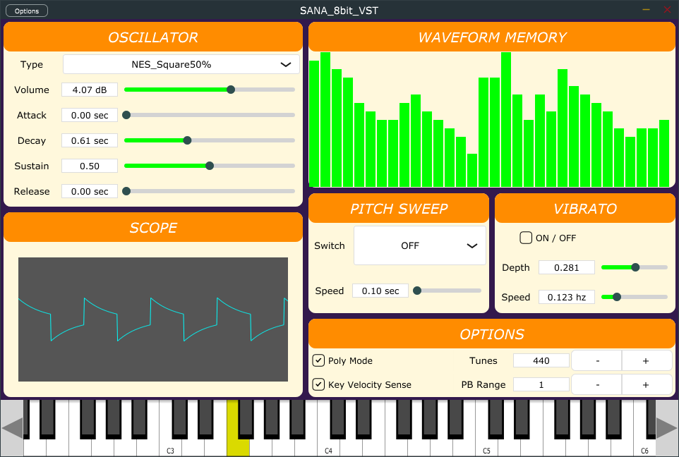

SANA 8BIT VST
====

Overview  
This is Simple VSTi Synthesizer for chiptune.

## Description
This is VSTi project made by JUCE 5.3.1 Library.
"SANA 8BIT VST" is name of the Synthesizer.
It has a Oscillator, pitch sweep function, vibrato function and Wave scope.
Oscillator can switch several waveforms and has ADSR function. And you can write own waveform on the WAVEFORM MEMORY component.

This is a windows 32bit/64bit Application. It builded as DLL format. And you can install your DAW easily.

## Demo

## How to Use
Getting Ready

## Install
Import SANA_8BIT_VST.dll files to your DAW's Plugin folder.
If you want to uninstall, delete its dll files.

## Environment
Windows 32bit/64bit

I tested following DAW.
* Studio One 2, 3, 4
* REAPER 5.94
* Cubase8.5, 9.5
* SONAR X2
* FL Studio 12, 20
* Live 10 Suite
* Ableton Live 9
* Waveform 8

## Build Instructions on Windows
1. Download Juce (http://www.juce.com/)
2. Download the VST SDK (http://www.steinberg.net/en/company/developers.html)
3. Run "The Projucer" executable included in Juce.
4. Open juce project file "xxx.jucer"
   1. Make any changes to the configure and build options.
   1. Save juce project if modified
5. Hit "Save Project and Open in Visual Studio". I use Visual Studio 2017.
6. Select the build: "Release - x64" and set platform to x64(64bit). Otherwise, "Release - Win32" and set platform to x86(32bit).
7. Build and deploy to plugin folder.

## Licence
[GPL3.0](./LICENSE)

## Author
[Masaki Mori](https://github.com/m-masaki72)

## Contributor
[COx2](https://github.com/COx2)  
[https://github.com/COx2/JUCE_JAPAN_DEMO]https://github.com/COx2/JUCE_JAPAN_DEMO

## Technologies Used
* C++ for the language
* JUCE for the framework/library
* Steinberg VST SDK
* Visual Studio for the IDE
